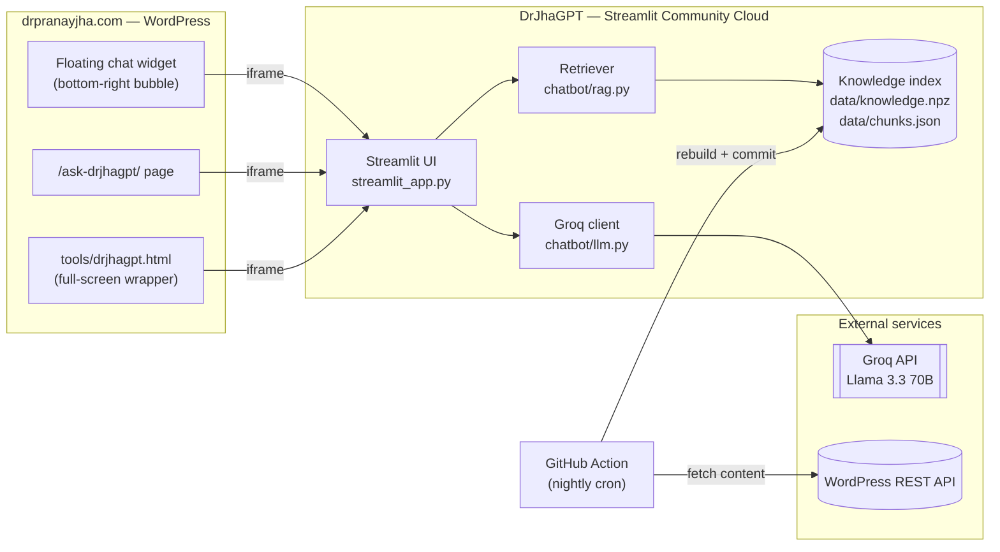
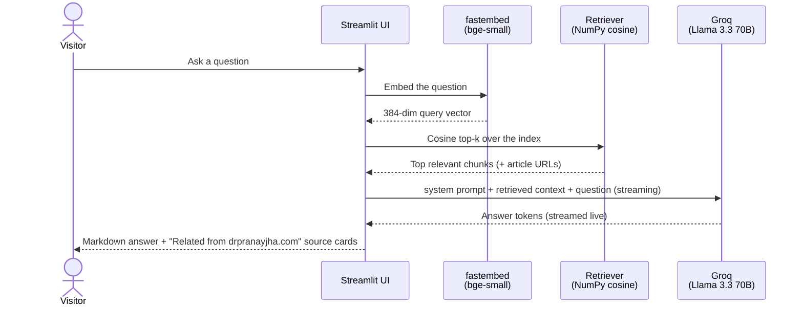
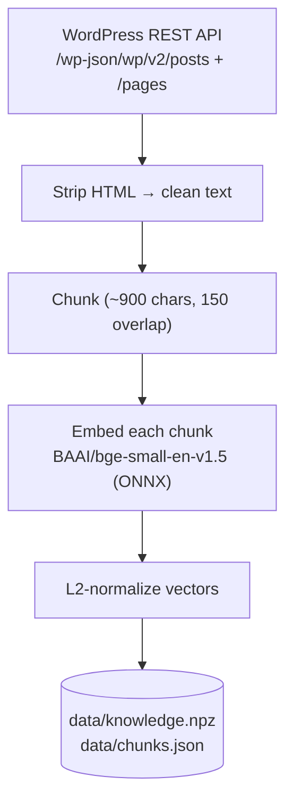

# DrJhaGPT — Architecture

An end-to-end look at how **DrJhaGPT** is built: an open-source, retrieval-augmented
chatbot that answers questions about VMware, cloud, datacenters, and AI using
Dr. Pranay Jha's published work at [drpranayjha.com](https://drpranayjha.com).

The entire stack is **open-source and free to run** — no proprietary AI services.

---

## 1. High-level architecture



The app is a single Streamlit process. It reads a **prebuilt knowledge index**
(committed to the repo), retrieves the most relevant snippets for each question,
and asks an **open-source LLM** to answer using those snippets as grounding.

---

## 2. Request flow (what happens when someone asks a question)



Key design points:
- **Grounded answers.** The model is instructed to answer from the retrieved
  context and cite the article with its real URL; if the context doesn't cover it,
  it says so before falling back to general knowledge.
- **Streaming.** Answers render token-by-token for a responsive feel.
- **Cited sources.** Each answer shows clickable links to the source articles.

---

## 3. Ingestion pipeline (how the knowledge index is built)



Run manually with `python ingest/build_index.py`, or automatically every night
via the GitHub Action (see §6). At the last build the site produced **~7,500
chunks** from 600+ posts and pages.

---

## 4. Technology stack

| Concern | Choice | Why |
|---|---|---|
| **LLM (generation)** | **Meta Llama 3.3 70B** (`llama-3.3-70b-versatile`), served via the **Groq** API | Open-source model, very fast inference, generous free tier, no infra to run. Swappable via `GROQ_MODEL`. |
| **Embeddings** | **fastembed** with `BAAI/bge-small-en-v1.5` (384-dim) | ONNX runtime — no PyTorch, so it installs light and runs on modest hosts. |
| **Vector search** | **NumPy** cosine similarity | For a few thousand chunks this is instant and needs no vector DB / native deps. |
| **UI** | **Streamlit** | Fast to build, easy to theme, one-click deploy. |
| **Knowledge source** | WordPress REST API of drpranayjha.com | Clean, structured content — no fragile HTML scraping. |
| **Hosting** | Streamlit Community Cloud | Free, deploys straight from GitHub. |
| **Auto-refresh** | GitHub Actions (nightly cron) | Keeps the index current with new posts, hands-free. |

**LLM generation parameters** (`chatbot/llm.py`): `temperature=0.3`,
`max_tokens=1024`, `stream=True`, with a system prompt that defines DrJhaGPT's
persona and grounding rules.

No paid infrastructure — the only external dependency is a free Groq API key.

---

## 5. Repository layout

```
streamlit_app.py            Main app + UI (entry point for Streamlit Cloud)
chatbot/
  config.py                 Settings from env / Streamlit secrets + branding
  llm.py                    Groq client, system prompt, streaming generation
  rag.py                    Embed query + cosine retrieval over the index
ingest/
  build_index.py            Pull site content → chunk → embed → save index
data/
  knowledge.npz             L2-normalized float32 embedding vectors
  chunks.json               Chunk text + {title, url} metadata (aligned to vectors)
assets/logo.png             Brand logo (page icon + assistant avatar)
.streamlit/config.toml      Brand theme (white editorial + red accent)
.github/workflows/
  refresh-index.yml         Nightly index rebuild
requirements.txt            streamlit, groq, fastembed, numpy, requests, python-dotenv
```

---

## 6. Auto-indexing (`.github/workflows/refresh-index.yml`)

Runs on GitHub's servers — **no local machine or manual step required**:

- **Schedule:** nightly at 18:30 UTC (00:00 IST), plus a manual "Run workflow" button.
- **What it does:** installs deps → runs `ingest/build_index.py` → commits the
  refreshed `data/` index if content changed → pushes.
- **Effect:** Streamlit Cloud auto-redeploys on the push, so the chatbot's
  knowledge stays current with newly published articles.
- **No secrets needed** — indexing only reads the public WordPress REST API.

---

## 7. Website integration (drpranayjha.com)

The same deployed app is surfaced in several places, all under the site's own domain:

- **Floating widget** — a bottom-right chat bubble injected site-wide via a small
  WordPress footer script; the iframe loads only on first click (no page-load cost)
  and uses a compact "mini" layout (`?embed=true&mini=1`).
- **Dedicated page** — `/ask-drjhagpt/`, full-width, with an "Open full-screen chat" button.
- **Full-screen wrapper** — `tools/drjhagpt.html`, a thin page on the site's own
  domain that embeds the app full-viewport, so the visible URL stays `drpranayjha.com`.
- **Discovery** — listed in the site's *Latest Blogs* ticker (as a Tool) and in the
  *Architect's Toolkit* under "PJ's Tools".

---

## 8. Configuration

Copy `.env.example` → `.env` (local) or set Streamlit **Secrets** (deployed):

| Variable | Default | Purpose |
|---|---|---|
| `GROQ_API_KEY` | — | Free key from console.groq.com |
| `GROQ_MODEL` | `llama-3.3-70b-versatile` | Open model served by Groq |
| `RAG_TOP_K` | `4` | Snippets retrieved per question |
| `RAG_MIN_SCORE` | `0.30` | Minimum similarity to include a snippet |

---

## 9. Cost & limits

- **Free** to run: Groq's free tier covers generation; embeddings and retrieval
  are local/CPU; hosting is Streamlit Community Cloud's free tier.
- Every visitor's questions draw on the owner's Groq free-tier quota, so a public
  deployment may want basic rate-limiting if traffic grows.
- Streamlit Community Cloud sleeps after inactivity; the first visitor after a nap
  waits a few seconds for wake-up.

---

_Built and maintained by Dr. Pranay Jha — [drpranayjha.com](https://drpranayjha.com)._
