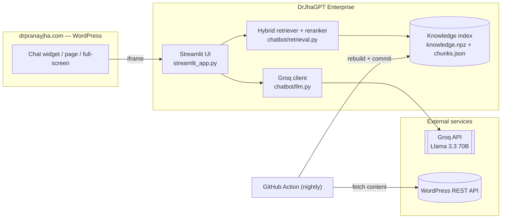
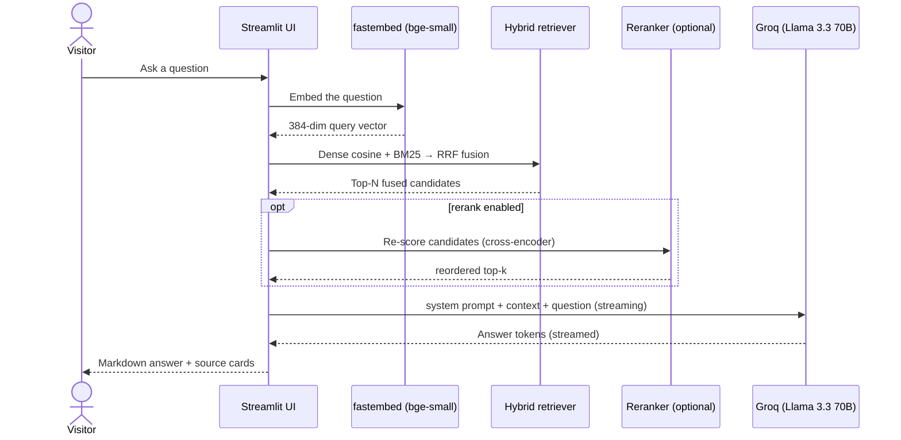
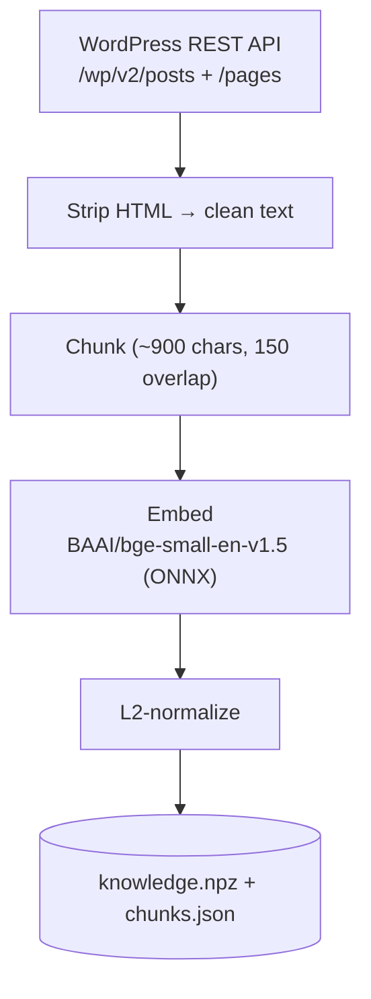

# DrJhaGPT Enterprise — Architecture

The **production-hardening track** for DrJhaGPT: an open-source, retrieval-augmented
chatbot over Dr. Pranay Jha's published work at
[drpranayjha.com](https://drpranayjha.com).

This repo keeps the base app's skeleton but upgrades the **retrieval stage** and
adds **evaluation**. **Phase 1 (shipped here):** hybrid retrieval (dense + BM25 via
Reciprocal Rank Fusion), cross-encoder **reranking**, and an **eval harness**. See
[ROADMAP.md](ROADMAP.md) for the target production architecture and Phases 2–3.

The stack is **open-source and free to run** — no proprietary AI services.

---

## 1. High-level architecture



---

## 2. Request flow



---

## 3. Retrieval pipeline (`chatbot/retrieval.py`) — the Phase 1 core

Three switchable modes, selected by `RETRIEVAL_MODE`:

| Mode | What it does |
|---|---|
| `dense` | Vector cosine similarity only (the base app's behavior). |
| `hybrid` | **Dense + BM25** keyword search, combined with **Reciprocal Rank Fusion (RRF)**. |
| `hybrid_rerank` | Hybrid candidates re-scored by a **cross-encoder reranker**, then top-k. |

- **Dense** — the query is embedded (bge-small, 384-dim) and scored against the
  L2-normalized index with a single NumPy dot product.
- **BM25** — a sparse keyword index (`rank-bm25`, `BM25Okapi`) over chunk
  title+text, catching exact tokens (error codes, SKUs, version strings, acronyms)
  that dense vectors miss.
- **RRF** — dense and BM25 rankings are fused via `1 / (k + rank)` summed across
  retrievers (`RRF_K = 60`), producing a robust combined candidate list.
- **Reranker** — a cross-encoder (`TextCrossEncoder`, `ms-marco-MiniLM-L-6-v2`)
  re-scores the top `RETRIEVE_CANDIDATES` fused hits for true query-document
  relevance before the final `RAG_TOP_K` reach the model.

`chatbot/rag.py` is a thin public interface (`has_knowledge` / `retrieve` /
`format_context`) that delegates to this module, so the UI is unchanged.

---

## 4. Evaluation (`eval/`)

Retrieval quality is **measured, not assumed**. `eval/run_eval.py` runs a golden
question set (`eval/golden.json`) through each mode and reports **hit-rate@k** and
**MRR** — no Groq key needed (retrieval only):

```bash
python eval/run_eval.py
```

**Current snapshot (8 questions, top_k=5):**

| mode | hit@5 | MRR |
|---|---|---|
| dense | 100.0% | 0.938 |
| hybrid | 100.0% | 0.938 |
| hybrid_rerank | 75.0% | 0.750 |

On this small, clean, in-domain corpus dense is already saturated, so `hybrid`
ties it (and adds keyword robustness), while a *generic* reranker slightly hurt —
so **rerank is off by default** until validated with a domain-appropriate model and
a larger golden set. The harness exists precisely to make that call with data.

---

## 4b. Phase 2 — security & observability (all open-source, no license)

Layered on top of the retrieval core, each toggle-able via config:

- **Auth (`chatbot/auth.py`)** — session-based login with **bcrypt**-hashed passwords
  and per-user **roles**, read from `.streamlit/auth.yaml`. Cookie-free (robust on any
  host, including Streamlit Cloud) and fails to a login form, never open. The app is
  gated — no chat until logged in. Demo: `demo` / `demo1234`. Upgrade path:
  Keycloak/Authentik for OIDC/SAML SSO.
- **Guardrails (`chatbot/guardrails.py`)** — before any model call, input is screened
  for **prompt-injection** (blocked if matched); **PII** is redacted (regex, or
  Microsoft **Presidio** if enabled) before it hits the logs; optional **moderation**
  via Groq's open **Llama Guard**.
- **Observability (`chatbot/observability.py`)** — each request records stage
  latencies (retrieve / generate), sources, user, and mode as a span-set to
  `logs/traces.jsonl` — the shape Arize **Phoenix** / OpenTelemetry consume, so it
  upgrades to a full trace UI with no call-site changes.

No license fees; the heavier upgrades (Keycloak, Presidio, Phoenix) are optional and
self-hosted.

---

## 5. Ingestion pipeline



Run with `python ingest/build_index.py`, or nightly via the GitHub Action (§8).
Structure-aware / parent-child chunking is a Phase 1 follow-up (see ROADMAP).

---

## 6. Technology stack

| Concern | Choice |
|---|---|
| **LLM (generation)** | **Llama 3.3 70B** via **Groq** — or any self-hosted OpenAI-compatible endpoint (vLLM/Ollama/NIM) |
| **Embeddings** | fastembed · `BAAI/bge-small-en-v1.5` (384-dim, ONNX) |
| **Keyword search** | `rank-bm25` (BM25Okapi) |
| **Fusion** | Reciprocal Rank Fusion |
| **Reranker** | fastembed `TextCrossEncoder` · `ms-marco-MiniLM-L-6-v2` |
| **Vector store** | in-memory NumPy (default) or **Qdrant** local/embedded (`VECTOR_BACKEND=qdrant`) |
| **Evaluation** | golden set + hit@k / MRR harness |
| **Auth** | session-based bcrypt login + roles (Keycloak SSO as upgrade) |
| **Guardrails** | injection heuristics + PII redaction + optional Groq Llama Guard |
| **Observability** | local per-request tracing (`logs/traces.jsonl`) |
| **UI** | Streamlit |
| **Knowledge source** | WordPress REST API of drpranayjha.com |
| **Auto-refresh** | GitHub Actions (nightly cron) |

---

## 7. Repository layout

```
streamlit_app.py            Main app + UI
chatbot/
  config.py                 Settings (incl. retrieval mode / rerank params)
  llm.py                    Groq client + streaming generation
  retrieval.py              Hybrid (dense + BM25 + RRF) + reranking  ← Phase 1
  rag.py                    Public interface, delegates to retrieval.py
  vectorstore.py            Optional Qdrant (local) vector backend   ← Phase 2
  auth.py                   Login gate (streamlit-authenticator)     ← Phase 2
  guardrails.py             Injection + PII + moderation             ← Phase 2
  observability.py          Per-request tracing → logs/traces.jsonl  ← Phase 2
ingest/
  build_index.py            Pull site content → chunk → embed → index
eval/
  golden.json               Golden question set (question + expected sources)
  run_eval.py               hit@k / MRR per retrieval mode              ← Phase 1
data/
  knowledge.npz             L2-normalized float32 vectors
  chunks.json               Chunk text + {title, url}
ROADMAP.md                  Target architecture + Phase 2/3 plan
requirements.txt            streamlit, groq, fastembed, numpy, requests,
                            python-dotenv, rank-bm25
```

---

## 8. Auto-indexing (`.github/workflows/refresh-index.yml`)

Nightly on GitHub's servers: install deps → `ingest/build_index.py` → commit the
refreshed `data/` index if content changed → push. No secrets (public content).

---

## 9. Configuration

| Variable | Default | Purpose |
|---|---|---|
| `GROQ_API_KEY` | — | Free key from console.groq.com |
| `GROQ_MODEL` | `llama-3.3-70b-versatile` | Model when using Groq |
| `LLM_PROVIDER` | `groq` | `groq` or `openai` (self-hosted endpoint) |
| `LLM_BASE_URL` | — | OpenAI-compatible endpoint for on-prem/air-gap (vLLM/Ollama/NIM) |
| `RAG_TOP_K` | `4` | Final snippets per question |
| `RETRIEVAL_MODE` | `hybrid` | `dense` \| `hybrid` \| `hybrid_rerank` |
| `RETRIEVE_CANDIDATES` | `40` | Fused candidates before rerank |
| `RRF_K` | `60` | Reciprocal-rank-fusion constant |
| `RERANK_MODEL` | `Xenova/ms-marco-MiniLM-L-6-v2` | Cross-encoder reranker |
| `VECTOR_BACKEND` | `numpy` | `numpy` (default) or `qdrant` (local vector DB) |
| `ENABLE_AUTH` | `1` | Require login (streamlit-authenticator) |
| `ENABLE_GUARDRAILS` | `1` | Injection block + PII redaction |
| `ENABLE_MODERATION` | `0` | Groq Llama Guard moderation (extra call) |
| `ENABLE_TRACING` | `1` | Write request traces to `logs/traces.jsonl` |
| `USE_PRESIDIO` | `0` | Use Presidio for PII (if installed) |

---

## 10. Cost & roadmap

Free to run today (Groq free tier + CPU retrieval + free hosting). The path to a
production, multi-tenant, governed deployment — real vector DB, auth,
observability, guardrails, permission-aware retrieval, self-hosted models — is laid
out in **[ROADMAP.md](ROADMAP.md)**.

---

_Built and maintained by Dr. Pranay Jha — [drpranayjha.com](https://drpranayjha.com)._
