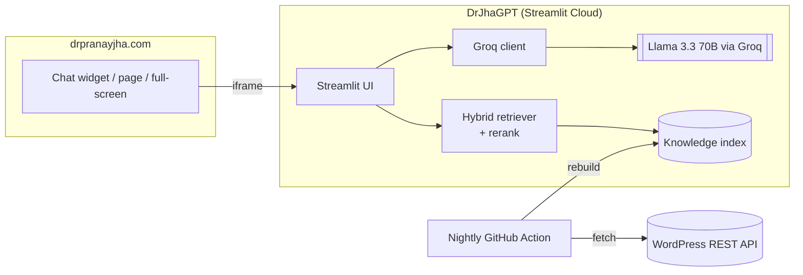

# DrJhaGPT Pro

**Studio for Technical Training — GenAI for Intelligent Infrastructure.**

A task studio for building and delivering technical training on **VMware, cloud,
Kubernetes, automation and AI infrastructure** — grounded in Dr. Pranay Jha's
published work at [drpranayjha.com](https://drpranayjha.com) and in any PDF you
upload (release notes, an admin guide, an exam blueprint).

Pick a tool, fill a short form, get a branded document you can refine, print,
export to Word, or publish to your team.

### The tools

| | |
|---|---|
| **Plan & teach** | Course Outline · Session Plan · Slide Outline · Architecture Diagram · Concept Explainer |
| **Hands-on** | Lab Guide · Demo Runbook · Troubleshooting Scenario |
| **Practice & assess** | Quiz Builder · Flashcards · Certification Study Plan |
| **Code & config** | Script Studio · Code Explainer · Cheat Sheet |
| **Deliver & publish** | Student Handout · Runbook / SOP · Article Draft · Trainer Comms |
| **Ask** | The original grounded RAG chat, over your site and your PDFs |

### What makes the output usable

- **Grounding** — any generator can retrieve from your published work and/or an
  uploaded PDF, so the material follows your own positions and terminology.
- **Version-aware** — every form takes a product version, stated explicitly in
  the prompt, so you don't get answers written for the wrong release.
- **Honest about uncertainty** — the model is instructed to append `[verify]`
  rather than invent a command flag, default or product capability.
- **Real diagrams** — the Architecture Diagram tool emits Mermaid, rendered live
  in the app and in the exported file, with a repair pass that fixes the syntax
  mistakes models reliably make.
- **Export that fits the job** — Word, Print/PDF, Markdown, copy-just-the-code,
  and CSV straight into Anki for flashcards.

### Working as a team (optional)

Add Supabase and the studio gains roles (Admin / Lead Trainer / Trainer /
Associate), tracks, a **shared library** of published material, self-serve access
requests and an audit log — see **[SUPABASE_SETUP.md](SUPABASE_SETUP.md)**.
Without it, everything above still works for a single trainer.

### Under the hood

Only free/open-source tools, no licenses:

- **Hybrid retrieval** — dense vectors + BM25 fused with Reciprocal Rank Fusion,
  optional cross-encoder reranking, with an evaluation harness.
- **Login + roles** (bcrypt session auth, database-first with a file fallback),
  **guardrails** (prompt-injection block + PII redaction + optional Llama Guard),
  **observability** (per-request tracing to `logs/traces.jsonl`).
- **Provider failover** — several Groq keys, then Google Gemini's free tier, so a
  document doesn't die half-written when a daily quota runs out.

See [ROADMAP.md](ROADMAP.md) for the full plan and target production architecture.
Demo login → **`demo` / `demo1234`** (change before real use).

🏢 **Deploying on-prem / in your datacenter (incl. air-gapped)?** → **[DEPLOYMENT.md](DEPLOYMENT.md)**

A fully **open-source, free-to-run** stack — no proprietary AI services.

## Architecture at a glance



**LLM:** Meta **Llama 3.3 70B** (`llama-3.3-70b-versatile`) served via the **Groq** API.

📐 **Full details, request/ingestion flows, and diagrams:** see [ARCHITECTURE.md](ARCHITECTURE.md).

## Stack

| Concern | Technology |
|---|---|
| UI | Streamlit |
| LLM (generation) | Llama 3.3 70B via **Groq**, failing over to **Gemini** free tier — or any **self-hosted** OpenAI-compatible endpoint (vLLM/Ollama/NIM) |
| Embeddings | [fastembed](https://github.com/qdrant/fastembed) (ONNX, no PyTorch) |
| Retrieval | **Hybrid** — dense vectors + BM25, fused with Reciprocal Rank Fusion; optional cross-encoder reranker |
| Documents | Markdown → sanitised HTML (bleach) with Pygments highlighting and Mermaid diagrams |
| Evaluation | Golden-set harness (hit@k / MRR per mode) |
| Auth | session-based **bcrypt** login + roles (Supabase first, `auth.yaml` fallback); OIDC/SSO seam in `auth.authenticate()` |
| Team features | Supabase (PostgREST) — people, tracks, shared library, access requests, audit log |
| Guardrails | injection block + PII redaction + optional Groq Llama Guard |
| Observability | local per-request tracing (`logs/traces.jsonl`) |
| Knowledge source | WordPress REST API of drpranayjha.com + uploaded PDFs |

Fully open-source, no paid infrastructure.

## Project layout

```
streamlit_app.py        Shell: styling, sidebar, router, and the Ask (chat) tool
chatbot/
  config.py             Settings + the domain vocabulary every form is built from
  studio.py             Tool registry, generate/refine loop, export, publishing
  tools.py              The 18 generator forms - one function each
  prompts.py            House style (BASE_SYSTEM) + one prompt builder per tool
  render.py             Markdown -> branded document: icons, code, Mermaid, Word
  admin.py              Shared library + Admin Console (people, tracks, requests)
  store.py              Supabase (PostgREST) - people, library, requests, audit
  auth.py               Session login (bcrypt), DB-first with auth.yaml fallback
  llm.py                Groq / Gemini / OpenAI-compatible streaming + failover
  retrieval.py          Hybrid (dense + BM25 + RRF) + reranking
  rag.py                Public retrieval interface, delegates to retrieval.py
  documents.py          PDF upload -> chunk + embed (grounding + chat)
  guardrails.py         Injection block + PII redaction + moderation
  observability.py      Per-request tracing to logs/traces.jsonl
  vectorstore.py        Optional Qdrant (local) vector backend
ingest/build_index.py   Pull site content -> embed -> save index
eval/                   Golden set + hit@k / MRR harness
scripts/make_hash.py    Generate a bcrypt password hash for auth.yaml
data/                   Prebuilt knowledge index (committed)
.streamlit/
  config.toml           Brand theme
  auth.yaml             Fallback users + roles (change before real use)
SUPABASE_SETUP.md       Optional multi-trainer setup (SQL + secrets)
ROADMAP.md              Target architecture + phased plan
```

## Run locally

```bash
python -m venv .venv
.venv\Scripts\activate            # Windows  (source .venv/bin/activate on macOS/Linux)
pip install -r requirements.txt

copy .env.example .env            # then paste your Groq key into .env
python eval/run_eval.py           # compare retrieval modes (no Groq key needed)
streamlit run streamlit_app.py    # index is committed; rebuild via ingest/ when content changes
```

Get a free Groq API key at <https://console.groq.com/keys>.

## Tests & CI

```bash
pip install pytest
pytest                     # unit tests: guardrails, tracing, retrieval
python eval/run_eval.py    # retrieval eval (dense / hybrid / hybrid_rerank)
```

CI runs both on every push (`.github/workflows/ci.yml`).

## Docker

```bash
docker compose up --build  # serves on http://localhost:8501
```

## Deploy free (Streamlit Community Cloud)

1. Push this repo to GitHub.
2. Go to <https://share.streamlit.io>, connect the repo, set the main file to
   `streamlit_app.py`.
3. In **Settings → Secrets**, add:
   ```
   GROQ_API_KEY = "your_key_here"
   ```
4. Deploy. You'll get a public URL to link or embed on drpranayjha.com.

## Embed on your website

```html
<iframe src="https://YOUR-APP.streamlit.app/?embed=true"
        width="100%" height="700" style="border:0;"></iframe>
```

## Credits

Built and maintained by **Dr. Pranay Jha** — [drpranayjha.com](https://drpranayjha.com)
