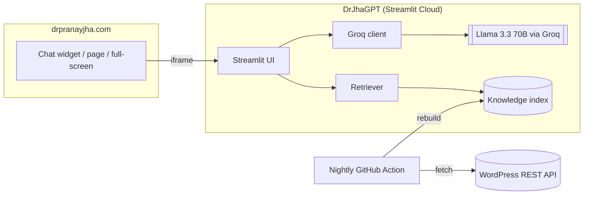

# DrJhaGPT Enterprise

**GenAI for Intelligent Infrastructure — production hardening track.**

An open-source RAG (Retrieval-Augmented Generation) chatbot that answers
questions about **VMware, cloud, datacenters, and AI** using Dr. Pranay Jha's
published work at [drpranayjha.com](https://drpranayjha.com).

This repo evolves the base assistant toward an **enterprise-grade** system.
**Phase 1 (in this repo):** hybrid retrieval (dense + BM25 via Reciprocal Rank
Fusion), cross-encoder **reranking**, and an **evaluation harness**. See
[ROADMAP.md](ROADMAP.md) for the full plan and the target production architecture.

A fully **open-source, free-to-run** stack — no proprietary AI services.

## Architecture at a glance



**LLM:** Meta **Llama 3.3 70B** (`llama-3.3-70b-versatile`) served via the **Groq** API.

📐 **Full details, request/ingestion flows, and diagrams:** see [ARCHITECTURE.md](ARCHITECTURE.md).

## Stack

| Concern | Technology |
|---|---|
| UI | Streamlit |
| LLM (generation) | Open models (Llama 3.3 / Mixtral) via [Groq](https://groq.com) free API |
| Embeddings | [fastembed](https://github.com/qdrant/fastembed) (ONNX, no PyTorch) |
| Retrieval | NumPy cosine similarity over a prebuilt index |
| Knowledge source | WordPress REST API of drpranayjha.com |

Fully open-source, no paid infrastructure.

## Project layout

```
streamlit_app.py        Main app (entry point for Streamlit Cloud)
chatbot/
  config.py             Settings (env / Streamlit secrets)
  llm.py                Groq client + streaming
  rag.py                Retrieval over your website content
ingest/
  build_index.py        Pull site content -> embed -> save index
data/                   Prebuilt knowledge index (committed)
.streamlit/config.toml  Brand theme (dark navy + red)
```

## Run locally

```bash
python -m venv .venv
.venv\Scripts\activate            # Windows  (source .venv/bin/activate on macOS/Linux)
pip install -r requirements.txt

copy .env.example .env            # then paste your Groq key into .env
python ingest/build_index.py      # build the knowledge index (one-time / on content change)
streamlit run streamlit_app.py
```

Get a free Groq API key at <https://console.groq.com/keys>.

## Deploy free (Streamlit Community Cloud)

1. Push this repo to GitHub.
2. Go to <https://share.streamlit.io>, connect the repo, set the main file to
   `streamlit_app.py`.
3. In **Settings → Secrets**, add:
   ```
   GROQ_API_KEY = "your_key_here"
   ```
4. Deploy. You'll get a public URL to link or embed on drpranayjha.com.

## Embed on your website

```html
<iframe src="https://YOUR-APP.streamlit.app/?embed=true"
        width="100%" height="700" style="border:0;"></iframe>
```

## Credits

Built and maintained by **Dr. Pranay Jha** — [drpranayjha.com](https://drpranayjha.com)
