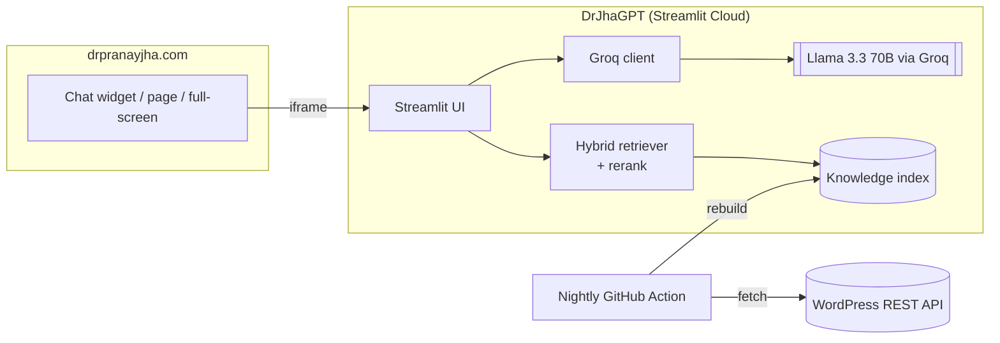

# DrJhaGPT Enterprise

**GenAI for Intelligent Infrastructure — production hardening track.**

An open-source RAG (Retrieval-Augmented Generation) chatbot that answers
questions about **VMware, cloud, datacenters, and AI** using Dr. Pranay Jha's
published work at [drpranayjha.com](https://drpranayjha.com).

This repo evolves the base assistant toward an **enterprise-grade** system, using
only free/open-source tools (no licenses):

- **Phase 1** — hybrid retrieval (dense + BM25 via Reciprocal Rank Fusion),
  cross-encoder **reranking**, and an **evaluation harness**.
- **Phase 2** (partly shipped) — **login + roles** (streamlit-authenticator),
  **guardrails** (prompt-injection block + PII redaction + optional Llama Guard),
  and **observability** (per-request tracing to `logs/traces.jsonl`).

See [ROADMAP.md](ROADMAP.md) for the full plan and target production architecture.
Demo login → **`demo` / `demo1234`** (change before real use).

A fully **open-source, free-to-run** stack — no proprietary AI services.

## Architecture at a glance



**LLM:** Meta **Llama 3.3 70B** (`llama-3.3-70b-versatile`) served via the **Groq** API.

📐 **Full details, request/ingestion flows, and diagrams:** see [ARCHITECTURE.md](ARCHITECTURE.md).

## Stack

| Concern | Technology |
|---|---|
| UI | Streamlit |
| LLM (generation) | Open models (Llama 3.3 / Mixtral) via [Groq](https://groq.com) free API |
| Embeddings | [fastembed](https://github.com/qdrant/fastembed) (ONNX, no PyTorch) |
| Retrieval | **Hybrid** — dense vectors + BM25, fused with Reciprocal Rank Fusion; optional cross-encoder reranker |
| Evaluation | Golden-set harness (hit@k / MRR per mode) |
| Auth | [streamlit-authenticator](https://github.com/mkhorasani/Streamlit-Authenticator) — login + roles (Apache-2.0) |
| Guardrails | injection block + PII redaction + optional Groq Llama Guard |
| Observability | local per-request tracing (`logs/traces.jsonl`) |
| Knowledge source | WordPress REST API of drpranayjha.com |

Fully open-source, no paid infrastructure.

## Project layout

```
streamlit_app.py        Main app (entry point for Streamlit Cloud)
chatbot/
  config.py             Settings (retrieval mode, auth/guardrails/tracing toggles)
  llm.py                Groq client + streaming
  retrieval.py          Hybrid (dense + BM25 + RRF) + reranking       (Phase 1)
  rag.py                Public interface, delegates to retrieval.py
  auth.py               Login gate (streamlit-authenticator)          (Phase 2)
  guardrails.py         Injection block + PII redaction + moderation  (Phase 2)
  observability.py      Per-request tracing to logs/traces.jsonl      (Phase 2)
ingest/build_index.py   Pull site content -> embed -> save index
eval/                   Golden set + hit@k / MRR harness
scripts/make_hash.py    Generate a bcrypt password hash for auth.yaml
data/                   Prebuilt knowledge index (committed)
.streamlit/
  config.toml           Brand theme
  auth.yaml             Demo users + roles (change before real use)
ROADMAP.md              Target architecture + phased plan
```

## Run locally

```bash
python -m venv .venv
.venv\Scripts\activate            # Windows  (source .venv/bin/activate on macOS/Linux)
pip install -r requirements.txt

copy .env.example .env            # then paste your Groq key into .env
python eval/run_eval.py           # compare retrieval modes (no Groq key needed)
streamlit run streamlit_app.py    # index is committed; rebuild via ingest/ when content changes
```

Get a free Groq API key at <https://console.groq.com/keys>.

## Deploy free (Streamlit Community Cloud)

1. Push this repo to GitHub.
2. Go to <https://share.streamlit.io>, connect the repo, set the main file to
   `streamlit_app.py`.
3. In **Settings → Secrets**, add:
   ```
   GROQ_API_KEY = "your_key_here"
   ```
4. Deploy. You'll get a public URL to link or embed on drpranayjha.com.

## Embed on your website

```html
<iframe src="https://YOUR-APP.streamlit.app/?embed=true"
        width="100%" height="700" style="border:0;"></iframe>
```

## Credits

Built and maintained by **Dr. Pranay Jha** — [drpranayjha.com](https://drpranayjha.com)
