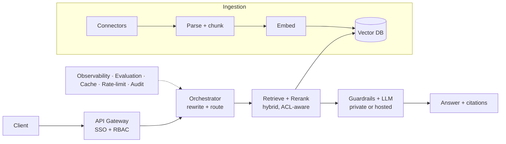

# DrJhaGPT Enterprise — Roadmap

This repo takes the base [DrJhaGPT](https://github.com/impranayk/DrJhaGPT) RAG
assistant and hardens it toward a production, enterprise-grade system. The base
app is deliberately minimal (vector search → prompt → answer); this one adds the
layers that make RAG trustworthy at scale.

> **Status:** Phase 1 in progress (hybrid retrieval + reranking + evaluation).

## Target production architecture



## Phases

### Phase 1 — Quality (this repo, in progress)
Highest return on effort, cheapest to add.
- [x] **Hybrid retrieval** — dense vectors + BM25 keyword search fused with
      Reciprocal Rank Fusion (`chatbot/retrieval.py`)
- [x] **Cross-encoder reranking** — re-score fused candidates for relevance
- [x] **Evaluation harness** — golden set + hit-rate\@k / MRR per mode
      (`eval/run_eval.py`), so every change is measured
- [ ] Structure-aware / parent-child chunking in the ingestion step
- [ ] Query rewriting + multi-query expansion

### Phase 2 — Hardening (partly shipped, all open-source)
- [x] **Auth** — login + per-user roles via `streamlit-authenticator` (`chatbot/auth.py`)
- [x] **Guardrails** — prompt-injection block + PII redaction + optional Groq **Llama Guard**
      moderation (`chatbot/guardrails.py`)
- [x] **Observability** — per-request tracing of stage latencies, sources, and user, written
      to `logs/traces.jsonl` (`chatbot/observability.py`)
- [x] **CI** — `pytest` suite + retrieval eval on every push (`.github/workflows/ci.yml`)
- [x] **Containerize** — `Dockerfile` + `docker-compose.yml`
- [x] Real **vector database** — **Qdrant** (local/embedded, no server); toggle `VECTOR_BACKEND=qdrant` (NumPy stays default). Managed/clustered Qdrant or pgvector next.
- [ ] Incremental / real-time index updates (vs. nightly full rebuild)
- [ ] Kubernetes manifests + IaC (Terraform)
- [ ] **Upgrade paths** (all open-source): **Keycloak** SSO · **Presidio** PII · **Phoenix/Langfuse** trace UI

### Phase 3 — Enterprise
- [ ] **Permission-aware retrieval** (ACL-filtered results)
- [ ] Multi-tenancy + quotas
- [ ] Compliance, audit logging, data residency
- [ ] **Self-hosted / private models** (on-prem GPUs, e.g. NIM) for data sovereignty
- [ ] Agentic / GraphRAG where the use case demands it

## Trying Phase 1

```bash
python -m venv .venv && .venv\Scripts\activate      # (source .venv/bin/activate on macOS/Linux)
pip install -r requirements.txt
python eval/run_eval.py        # compare dense vs hybrid vs hybrid_rerank
```

Switch the app's live retrieval mode via the `RETRIEVAL_MODE` setting
(`dense` | `hybrid` | `hybrid_rerank`).

## Evaluation snapshot (8-question golden set, top_k=5)

| mode | hit@5 | MRR |
|---|---|---|
| dense | 100.0% | 0.938 |
| hybrid | 100.0% | 0.938 |
| hybrid_rerank | 75.0% | 0.750 |

**Reading it:** on this small, clean, in-domain corpus, dense retrieval is already
saturated, so hybrid matches it (and adds keyword robustness for exact-term
queries the golden set doesn't stress), while a *generic* `ms-marco` reranker
demoted the correct article on two questions. Reranking is therefore **off by
default** here — the lesson is to **measure before enabling it**, and to revisit
with a domain-appropriate reranker (e.g. `BAAI/bge-reranker-base`) and a larger,
representative golden set. On a bigger, noisier enterprise corpus, hybrid + rerank
typically wins clearly; this harness is how you prove it either way.
